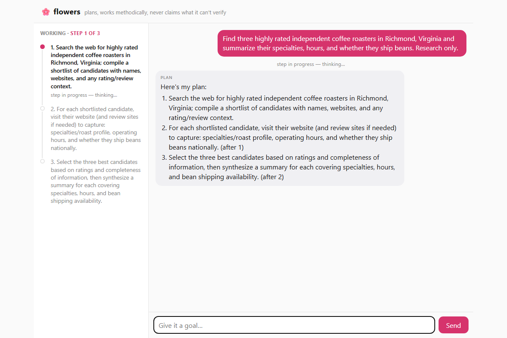

# flowers

[](https://github.com/asashepard/flowers/actions/workflows/ci.yml)
[](LICENSE)


**A trustable agent that never lies about what it accomplished.** Give it a goal in plain language; it
uses tools to make something happen in the world, and a deterministic, **no-LLM** gate refuses to report
"done" unless the world actually reflects the effect.

## The trust gate (this is the point)

Most agents decide they succeeded by *asking a model* whether they succeeded. flowers doesn't. Instead:

- Every world-touching call goes through a single credentialed **broker** (`flowers/broker.py`). The
  executor (the part the LLM drives) **holds no credentials** — it cannot authenticate to a provider
  directly; it asks the broker, which is the single egress for credentialed effects. (The wired-default
  sandbox runs shell/file work locally with secrets stripped from the environment; the optional `E2BSandbox`
  in `flowers/extras/` adds full microVM isolation whose only egress is the broker.)
- For each side-effect, the broker takes an **independent before/after read-back** from the provider (e.g.
  after a "send email," it reads the Sent mailbox) and builds a typed `EffectRecord` — a factual record of
  what actually changed in the world.
- A pure, zero-dependency gate adjudicates that record:
  [`flowers/trustgate.py`](flowers/trustgate.py) + [`flowers/effects.py`](flowers/effects.py) +
  [`flowers/policy.py`](flowers/policy.py). The verdict is computed by fingerprint-matching the expected
  effect against the read-back — **no LLM is in this path.**
- The verdict is a **pure function of that `EffectRecord`**. The only levers a model/owner can pull (the
  auto/ask/never policy overrides and the autonomy mandate) can *raise* strictness; they never touch
  verification, so they cannot authorize what the gate refuses. A fabricated "done" that never landed is
  refused by construction, proven by tests through the real code path.

Money-out is an **architectural refusal**, not a prompt: money-moving toolkits are categorically rejected
by the policy layer, and there is no charging path anywhere in the code.

If you read three files, read those three.

## The dashboard

`flowers serve` gives you a live two-pane chat dashboard: a timeline of the agent's plan animating as
steps execute (including heartbeats while it thinks and searches), and a chat transcript where you
approve actions, answer questions, redirect it mid-run, and pick up escalated runs. Events are durable —
restart the server mid-run and a reconnecting dashboard replays the full timeline and picks up live.

<!-- TODO: screenshot -->
<!--  -->

## Quickstart

```bash
pip install -e ".[web]"          # the dashboard + REST API (Starlette + uvicorn). The core needs only the stdlib.
pytest                           # the whole suite runs offline, no keys, no network, $0
flowers serve                    # dashboard + REST API at http://127.0.0.1:8000
```

With no keys, flowers wires the offline fakes, so the dashboard, `/health`, the REST endpoints, and the
**full test suite** all work at $0. *Running a goal needs a model*: without `OPENROUTER_API_KEY`,
`POST /api/goal` fails fast with a 503 telling you exactly that.

For real work, set three keys — copy `.env.example` to `.env` and fill them in (the app loads `.env`
from the working directory at startup; a real environment variable always wins):

| Variable | What it enables | Where to get it |
|---|---|---|
| `OPENROUTER_API_KEY` | the model (planner + executor) | [openrouter.ai](https://openrouter.ai/settings/keys) |
| `TAVILY_API_KEY` | web search | [app.tavily.com](https://app.tavily.com) |
| `ARCADE_API_KEY` | Gmail send + Google Calendar ("dev mode" connects your own Google account) | [arcade.dev](https://api.arcade.dev/dashboard) |
| `BROWSERBASE_API_KEY` + `BROWSERBASE_PROJECT_ID` | browser last-mile (off by default; needs `.[browser]`) | [browserbase.com](https://browserbase.com) |
| `FLOWERS_DB` / `FLOWERS_TIMERS_DB` | sqlite paths (defaults: `flowers.db`, `flowers_timers.db`) | — |
| `FLOWERS_TICK_SECONDS` | durable-timer poll cadence (default 15; 0 disables) | — |
| `FLOWERS_FORCE_OFFLINE` | pin every adapter offline (the test suite sets this) | — |

See [`.env.example`](.env.example) for every knob, including the optional-adapter keys.

flowers is a **single-user, local** tool: the dashboard and REST API have **no auth**, so run it on
`localhost` (the default bind) and don't expose the port to an untrusted network.

## Using the REST API

A terminal or chat client is just `curl` — full reference in [`docs/API.md`](docs/API.md):

```bash
# start a goal
curl -X POST localhost:8000/api/goal -H 'content-type: application/json' \
     -d '{"text":"find three nearby florists open on Sunday and summarize their hours"}'

# stream events for a run (Server-Sent Events; supports Last-Event-ID / ?after=<id> resume)
curl -N localhost:8000/events/<run_id>

# answer anything the agent is waiting on — an approval, a clarifying question, an escalation —
# or just talk to it mid-run (it acknowledges and folds your message into its next step)
curl -X POST localhost:8000/api/answer -H 'content-type: application/json' \
     -d '{"run_id":"<run_id>","text":"yes"}'
```

Other routes: `GET /api/runs/{id}` (status), `GET /api/runs/{id}/events` (polling fallback),
`GET /health` (liveness), `GET /ready` (store reachable).

## Architecture

flowers is built on **seams**: one `Protocol` per external dependency (`flowers/seams/interfaces.py`), each
with an offline **Fake** and a key-gated **live adapter**. The engine run-loop is methodical —
clarify → plan → execute → **gate** → durable await/monitor/recurring — and parks long-running work on
durable timers so it survives a restart. Because every dependency has a Fake, the **entire test suite runs
at $0, offline, with no keys** (enforced by `conftest.py`).

```
flowers/
  trustgate.py  effects.py  policy.py   the deterministic, no-LLM verdict core — the showcase
  broker.py                             the single credentialed egress (the executor holds no keys)
  types.py                              core dataclasses + the EffectRecord trust contract
  engine/                               planner, operator, executor, clarifier, announcer, scheduler
  seams/                                model, search, integrations, browser, sandbox, store, timers, ...
  channels/                             web (the REST API + dashboard), inproc, base
  cli.py                                the `flowers` console command
  extras/                               optional cloud adapter templates (NOT wired by default)
docs/STATUS.md                          honest "what's real vs offline-fake"
docs/API.md                             the REST + SSE reference
tests/                                  offline ($0 / no-network) suite by contract
```

## Optional adapters (`flowers/extras/`)

Optional, heavier-weight adapters live in `flowers/extras/` as importable, lint-clean **templates** — they
are not wired into `build_app`. Each satisfies the same seam Protocol as its wired default; to use one,
construct it in place of the default in `flowers/app.py` and install the matching extra.

| Adapter | Replaces | Extra |
|---|---|---|
| `PostgresStore` | `SqliteStore` | `.[postgres]` |
| `E2BSandbox` | `LocalSubprocessSandbox` | `.[e2b]` |
| `LangfuseTracer` | `LocalTracer` | — (stdlib) |
| `BraveSearch` | (search fallback) | — (stdlib) |

## Browser last-mile

The browser seam (observer-verified web actions) is **off by default**. Install the extra
(`pip install -e ".[browser]"`) and set `BROWSERBASE_API_KEY` + `BROWSERBASE_PROJECT_ID` to enable
`BrowserbaseBrowser`; otherwise the offline `FakeBrowser` is used. Even live, browser actions are
independently observed so the gate can confirm what actually happened.

## Status & honesty

[`docs/STATUS.md`](docs/STATUS.md) is the one honest doc: exactly what is real, what is a live adapter you
must key in, and what is a deliberate no-op.

## Contributing & maintenance

Contributions are welcome — see [`CONTRIBUTING.md`](CONTRIBUTING.md). The suite is offline and free, so a
green PR costs nothing to verify.

An honest note on maintenance: this is a part-time project. Issues and PRs may sit for a while, and the
scope is deliberately small (the trust gate is the point). If you want to take flowers in a substantially
different direction, **forking is encouraged** — it's Apache-2.0 ([`LICENSE`](LICENSE)), lift whatever is
useful.
